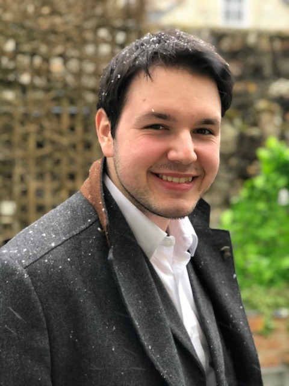

<a href="https://virtualvortex.github.io/UtilityBaseAI/">Home</a>

## About Me

My name is Max and I'm a Second year student at Falmouth University currenlty studying Game Development: Programming. Currently using Unity and C# to make games but trying to learn Unreal Engine 4 and C++/Blueprints. 

I worked on a game last year called 'Lost Kingdom of Turia' which was a 2D plaformer where you could befriend spirits and use their powers to progress through the levels. I also attended 2020's Global Game Jam a the University where me and the team created a fun game about reparing the opportunity Mars rover.

Both of these projects have helped me improve as both a programmer and a team member. In addition, I have been learning and improving on how to work in an agile envrioment for the past 2 years.
