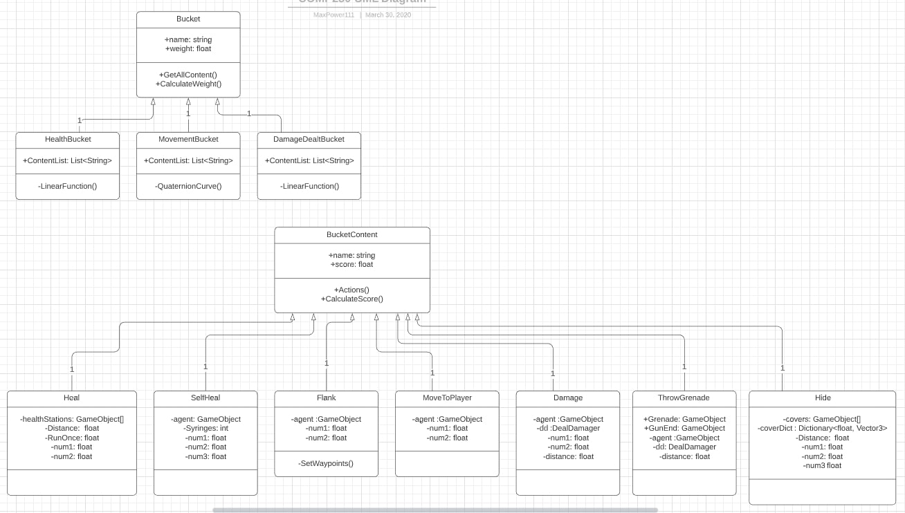

<a href="https://virtualvortex.github.io/UtilityBaseAI/AboutMe">AboutMe</a> <a href="https://virtualvortex.github.io/UtilityBaseAI/Development">Development</a>

## Utility Based AI for FPS Enemy AI 

In this project I will be creating an artefact using an AI technique called Utility Based AI for the enemy in an First Person Shooter (FPS) game. The AI will be able to move towards the player, try to shoot the player, throw grenades,Take cover, self heal, use heal stations and flank the player. All of this is created in Unity and programmed with C#

## Poster

my poster about the artefact can be downloaded here: <a href="COMP250 Poster (2).pdf" Download >Poster</a>

## UML Diagram of the Arefact

Fig1: Oates, Max. 2020. UML Diagram of bucket and action classes

## Research

Utility Based AI is a technique with relative options that it can use to solve its current problem. It makes its decisions based on utilities (scores) that are provided by picking the action with the highest utility. There are different ways to calculate utility, by using equations such as Step, Linear, Sigmoid or other graph based equations, where the utility of the actions varies on the input value. Dual Utility Reasoning is a technique that uses both Utility based AI techniques and combines them. The two techniques are Absolute utility where the action with the highest utility is picked and Relative utility, where an action is picked at random. 

Each action is stored in a hierarchy or ‘bucket’ that’s relative to the action. For example, a health bucket could contain actions such as ‘use syringe’ which has a score of 10 and ‘use Bandage’ with a score of 5, scores are also refered to as weights. Each bucket has a weight sometimes called ranks, which are used in the AI’s decision making, the bucket with the greater weight will have higher priority over the other buckets. The weight of the buckets can be randomised, or the weight can change depending on the situation and the AI compares a random number it generates to the weights, picking the bucket with the closest one (Graham 2020). Instead of picking the hightest utility it will pick the lowest utility due to how it calculate the score and weights.  

## Video

<video src="2020-02-24 09-20-56.mp4" poster="AIScreenshot.jpg" width="520" height="400" controls preload></video>
Fig2: Oates, Max. 2020. Example of gameplay

The video is place holder

## Argument

I Decided to use Utility Based AI due to it allowing the enemy AI to remain entertaining and less predictable when re-playing the game, which is a phenomenon that occurs on most games. Michelle, who also aimed to take care of the same problem by researching a different AI techniqe, used examples such as the 'Big Daddys' from Bioshock and the Striders from Half Life, stating that "come the end of the game and you’re often ploughing through computerised enemies with ease – the bots are no longer the insurmountable challenge they were when you first saw them" (McPartland 2013). In addition, it has been stated that Utility Based AI if done right could potentially make decisions for parts of the game that the AI designer may not have considered.   

The advantages of using Utility Based AI is that it can be used for complex behaviour and as an alternative to behaviour trees if the developers are unable to implement them(Kylotan 2018). 

A disadvantage of using Utility Based AI is that a lot of time and testing is required to make the AI entertaining for the player. This is because of how the utility is calulated and may need to be changed. In addition, the numbers that the AI uses to calculate the utilities may need to be changed as well. The other disadvantage with Utility Based AI is that though the AI may make calculations and use them to make decisions, it isn't Machine learning. By this I mean it could work the same as a Finite State Machines (FSM) or behaviour tree behaves in an environment, which had occasionally been the case when working with the AI (Rasmussen 2016).

Behaviour trees or reinforcement learning could be used as an alternative for the AI as it can be argued that Utility Based AI is a combination of both techniques. Behaviour trees consist of tasks that you can assign to run depending on the state of the environment, however they will always react the same way to the same changes in their enviroment(Rasmussen 2016). 

Reinforcement learning allows designers to create enemy AI with different characteristics, this is done by training the AI in real time by either changing the enviroment or values in the AI. This type of AI technique makes testing and altering the AI faster and more accessible, especially to designers, compared to Utility Based AI. That being said the AI will not change in the game itself, only during the development of the game (McPartland 2013). 

# Conclusion

Looking at how the AI functions in the level I would make the levels smaller but not compact as they appear to work better closer rather than further away from the player but are still challenging either way.  In addition, the AIs do show promise due to their ability to make decisions and perform different actions. I feel like it was able to solve the problem but not as well as expected due to it still feeling predictable at times. However, this may be due to the limitations of Utility Based AI as this technqiues doesn't improve itself overtime like neural networks and is only limited to its default actions and decisions making processes.

If I were to improve, I would use Dictionaries instead of factory patterns to permanently store buckets and actions when organizing them, as I believe it would make accessing the information easier, then using factory patterns and an FSM-like structure, when calling actions and buckets. In addition, I belive it would make the AI more accessible to designers and make testing faster.

I would also spend more time experimenting with different ways it makes decisions. When using Utility Based AI I would use one of the standard techniques instead of Dual Utility Reasoning, mainly because trying to get everything set up and working, was more problematic then it seemed. I would also do this to see if the AI would preform better.

# Bibliography
GRAHAM, David “. 2020. 'An Introduction to Utility Theory'. In Anonymous Game AI Pro 360. (1st edn). CRC Press, 67-80. 

RASMUSSEN, Jakob. 27/04/16. 'Are Behavior Trees a Thing of the Past?'. Available at: https://www.gamasutra.com/blogs/JakobRasmussen/20160427/271188/Are_Behavior_Trees_a_Thing_of_the_Past.php. [Accessed Feb 28,]. 

Kylotan. 2018. 'The Total Beginner's Guide to Game AI'. Available at: https://gamedev.net/tutorials/programming/artificial-intelligence/the-total-beginners-guide-to-game-ai-r4942. [Accessed Mar 7,].

DILL, Kevin. 2015. Game AI Pro 2: Collected Wisdom of Game AI Professionals. CRC Press.

MCPARTLAND, Michelle. 2013. 'Beaten by Bots – Training AI for First-Person Shooter Games'. Available at: http://theconversation.com/beaten-by-bots-training-ai-for-first-person-shooter-games-11176. [Accessed Mar 7,].

Fig. 1: Oates 2020. UML Diagram of bucket and action classes [UML Diagram]​

Fig. 2: Oates 2020. Example of gameplay [Video]​
