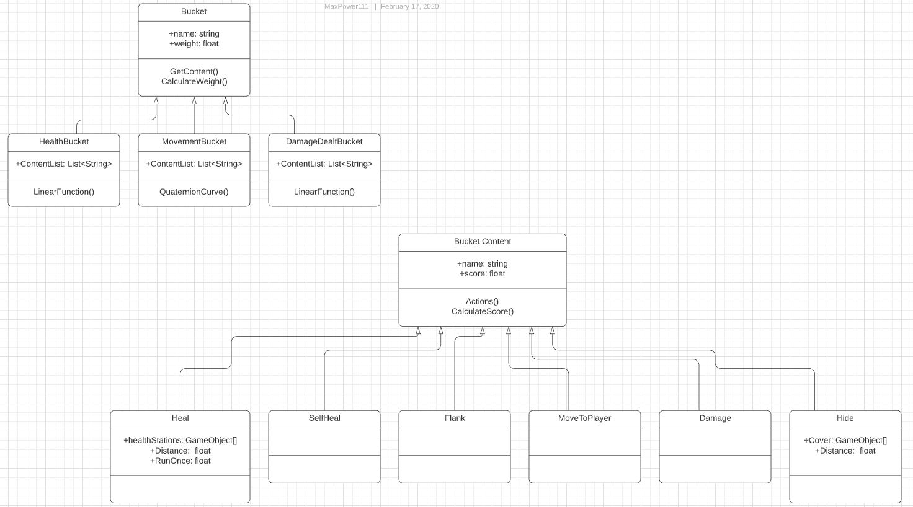

<a href="https://virtualvortex.github.io/UtilityBaseAI/AboutMe">AboutMe</a>

## Utility Based AI for FPS Enemy AI 

In this project I will be creating an artefact using an AI technique called Utility Base Systems for the enemy AI in an FPS game. The AI will be able to move towards the player, try to shoot the player, Take cover, self heal, use heal stations and flank the player   

## UML Diagram of the Arefact

## Research

Utility Based Systems is an AI technique with relative options that it can use to solve its current problem. It makes its decisions based on utilities (scores) that are provided by possibly picking the action with the highest utility. There are different ways to calculate utility, by using functions such as Step, Linear or Sigmoid, where the utility of the actions varies on the input value. Dual Utility is where each action is stored in a hierarchy or ‘bucket’ that’s relative to the action. For example, a health bucket could contain actions such as ‘use syringe’ which has a score of 10 and ‘use Bandage’ with a score of 5. Each bucket has a weight, which are used in the AI’s decision making, the bucket with the greater weight will have higher priority over the other buckets. The weight of the buckets can be randomised, or the weight can change depending on the situation and the AI compares a random number it generates to the weights, picking the bucket with the closest one (Graham 2020). 

## Video

## Development

## Argument

I Decided to use Utility Based AI due to it allowing the AI to be more fluid when making decisions rather than making decisions on strictly specific changes in the environment. In addition, it has been stated that Utility Based Systems if done right could potentially make decisions for parts of the game that the AI designer may not considered.   

Behaviour trees or neural networks could be used as an alternative for the AI as Utility Based AI is almost a combination of both techniques. Behaviours trees consist of tasks that you can assign to run depending on the state of the enviroment. 

Present claim
evidence to support and refute claim
pros and cons
experimental evidence
consider alternatives
justofy your decision based on evidence

# Bibliography
GRAHAM, David “. 2020. 'An Introduction to Utility Theory'. In Anonymous Game AI Pro 360. (1st edn). CRC Press, 67-80. 
